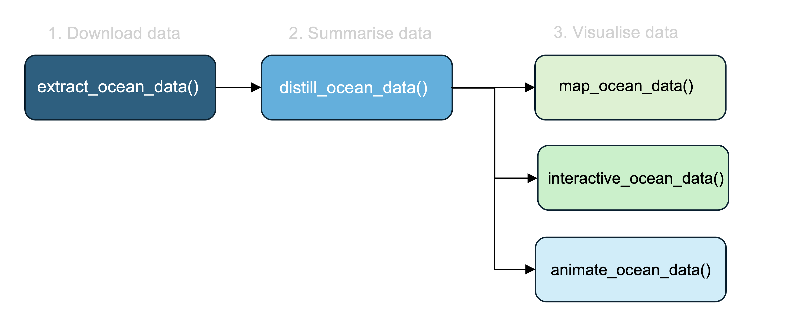
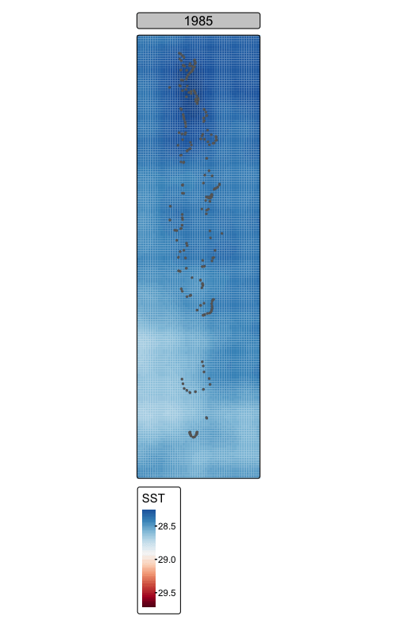

```{r setup, include=FALSE}
knitr::opts_chunk$set(echo = TRUE)
```

```{r, warning=FALSE, message=FALSE}

library(tidyverse)

```

`rOceanData` is a package currently in development with the aim of making satellite data easily accessible to researchers and stakeholders (managers, conservation groups, researchers). `rOceanData` accesses a wide range of ocean variables (e.g. sea surface temperature, chlorophyll, salinity) via built-in lists or via the [ERDAPP /griddap](https://coastwatch.pfeg.noaa.gov/erddap/griddap/documentation.html) servers.

The `rOceanData` workflow follows three steps: 1) extract data, 2) summarise data (e.g. yearly means), and 3) visualise data (static maps, interactive maps, animations):



The package is currently in development, and below are examples of basic functions:

## extract_ocean_data

rOceanData is an R package in development with the aim of simplifying access to satellite data on ocean health.

```{r, eval=TRUE, include=FALSE, warning=FALSE, message=FALSE, cache=TRUE}

maldives_data <- readRDS("/Users/rof011/rOceanData/data/maldivesNOAA_SST.rds")
```

The `space` argument can either be an area of ocean with determined by corner points (xmin, xmax, ymin, ymax), for example:

```{r, eval=FALSE, class.source = 'fold-show', warning=FALSE, message=FALSE}

maldives_data <- extract_ocean_data("NOAA_DHW", 
                                    space = c(72, 74.5, -1.5, 7.5), 
                                    time = c("1990-01-01", "2020-01-01"))  

```

```{r message=FALSE, warning=FALSE, cache=TRUE, include=FALSE}

head(maldives_data)

check_space <- function(space=c(70, 71, 1, 2), crs=4326){

    xmin=space[1]
    xmax=space[2]
    ymin=space[3]
    ymax=space[4]

    coords <- matrix(
    c(
      xmin, ymin,
      xmax, ymin,
      xmax, ymax,
      xmin, ymax,
      xmin, ymin  # Closing the polygon by repeating the first point
    ),
    ncol = 2, byrow = TRUE
  )

  # Create a list containing the coordinates matrix
  polygon_list <- list(coords)

  # Create the polygon and convert it to an sf object
  sf_polygon <- sf::st_sf( geometry = sf::st_sfc(sf::st_polygon(polygon_list), crs = crs))

  leaflet::leaflet() |>
    leaflet::addProviderTiles('Esri.WorldImagery', options=leaflet::providerTileOptions(maxNativeZoom=18,maxZoom=100)) |>
    leaflet::addPolygons(data = sf_polygon, color = "red", fill="red", weight = 1, opacity = 1, fillOpacity = 0.2) |>
    leafem::addMouseCoordinates()


}

```

Alternatively, if you need data for a particular set of sites with GPS points, upload an excel file with the longitude and latitude and `extract_ocean_data` will extract only the data for the corresponding points

```{r, eval=FALSE, warning=FALSE, message=FALSE, class.source = 'fold-show'}

site_sst_data <- extract_ocean_data(space = "files/sites/sitesurveys.xls", time = c("1990-01-01", "2020-02-01"))  

```

To check the `space` prior to downloading the data, use the `check_space` function:

```{r, eval=TRUE, fig.width=9, fig.height=7, warning=FALSE, message=FALSE, class.source = 'fold-show'}

check_space(space = c(72, 74.5, -1.5, 7.5))


```

## distill_ocean_data

[distil]{.underline} /dɪˈstɪl/ - "extract the essential meaning or most important aspects of"

Once the data is extracted, `distil_ocean_data()` is the second step of the workflow where data can be averaged through space (e.g. reducing the resolution from 1km \* 1km to say... 5 \* 5km resolution to meaningfully compare datasets) or through time (e.g. finding the average monthly data from a daily dataset).

For example, to get the mean SST for each gridcell across the entire time-series:

```{r,  eval=FALSE, warning=FALSE, message=FALSE, class.source = 'fold-show'}

maldives_sst_mean <- maldives_data %>% 
      distill_ocean_data(calculate=mean)

```

Or to get the mean maximum monthly SST for each gridcell :

```{r, eval=FALSE, warning=FALSE, message=FALSE, class.source = 'fold-show'}

maldives_sst_mmm <- maldives_data %>% 
      distill_ocean_data(group="month", calculate=max)

```

Or to get the mean annual SST for each gridcell:

```{r, eval=FALSE, warning=FALSE, message=FALSE, class.source = 'fold-show'}

maldives_sst_annual_mean <- maldives_data %>% 
      distill_ocean_data(group="year", calculate=mean)

```

## map_ocean_data

Map ocean data takes the summarised data from distill_ocean_data and generates static maps:

```{r, eval=FALSE, include=TRUE, class.source = 'fold-show'}

  maldives_sst_mean %>%
  map_ocean_data() 


```

```{r, fig.width=4, fig.height=7, warning=FALSE, message=FALSE, echo=FALSE}

  library(tmap)
  library(sf)
  


maldives_data_mean_stars <- stars::st_as_stars(maldives_data, dims=c("longitude", "latitude"),  y_decreasing = TRUE, coords = 1:2) |> st_set_crs(4326) |> st_transform(4326)
tmap_mode("plot")
map_countries <- (readRDS("/Users/rof011/rOceanData/data/map_countries.RDS")) |> st_transform(4326)
tm_shape(maldives_data_mean_stars) + 
  tm_raster("sea_surface_temperature", palette="-RdBu", title="SST", style="cont") +
  tm_legend(frame.lwd=0) +
  tm_shape(map_countries) + tm_borders() +
  tmap_options(component.autoscale=FALSE) +
  tm_title("Maldives mean Sea Surface Temperature \n(NOAA CRW, 1985-2023)", size=0.8) 
            
            
  
  

```

Alternatively, plot the annual means for each year in the time-series by specifying `by=`

```{r, eval=FALSE, include=TRUE, class.source = 'fold-show'}

  maldives_sst_annual_mean %>%
  map_ocean_data(by="year")

```

```{r, fig.width=10, fig.height=7, warning=FALSE, message=FALSE, echo=FALSE}

  library(tmap)
  library(sf)
  
maldives_data_mean_year <- maldives_data |> 
  mutate(year=year(time)) |> 
  group_by(longitude, latitude, year) |> summarise(sea_surface_temperature=mean(sea_surface_temperature))

maldives_data_mean_stars_year <- stars::st_as_stars(maldives_data_mean_year, dims=c("longitude", "latitude", "year"),  
                                                    y_decreasing = TRUE, coords = 1:2) |> st_set_crs(4326) |> st_transform(4326)

tmap_mode("plot")

map_countries <- (readRDS("/Users/rof011/rOceanData/data/map_countries.RDS")) |> st_transform(4326)

tm_shape(maldives_data_mean_stars_year) + 
    tm_raster(palette="-RdBu", style="cont", title="SST") +# breaks=seq(28, 30, 0.1)) +
tm_shape(map_countries) + 
  tm_borders(lwd=3) +
  tmap_options(component.autoscale=FALSE) +
  tm_layout(legend.outside = FALSE) + tm_facets_wrap(columns=12, free.scales=FALSE)
            
  
```

## interactive_ocean_data

Interactive ocean data takes the summarised data from distill_ocean_data and generates interactive maps:

```{r eval=FALSE, include=TRUE, class.source = 'fold-show'}

  maldives_sst_mean %>%
  interactive_ocean_data()

```

```{r fig.height=9, fig.width=6, warning=FALSE, message=FALSE, echo=FALSE}


maldives_data_mean_stars <- stars::st_as_stars(maldives_data, dims=c("longitude", "latitude"),  y_decreasing = TRUE, coords = 1:2) |> 
  st_set_crs(4326) |> 
  st_transform(4326)

tmap_mode("view")
tm_basemap("Esri.WorldImagery") +
tm_shape(maldives_data_mean_stars) + 
  tm_raster("sea_surface_temperature", palette="-RdBu", title="SST", style="cont") +
  tm_legend(frame.lwd=0) +
  tm_shape(map_countries) + tm_borders() +
  tmap_options(component.autoscale=FALSE) +
  tm_view(set.zoom.limits = c(7, 20)) +
  tm_title("Maldives mean Sea Surface Temperature \n(NOAA CRW, 1985-2023)", size=0.8) 
            
          
  
  

```

## animate_ocean_data

Animate ocean data takes the summarised data from distill_ocean_data and generates animations (similar to the `by="year"` in the map above)

```{r eval=FALSE, include=TRUE, class.source = 'fold-show'}

  maldives_sst_annual_mean %>%
  animate_ocean_data(by="year") %>%

```

```{r, fig.width=8, message=FALSE, warning=FALSE, height=10, echo=FALSE}

maldives_data_mean_year <- maldives_data |> 
  mutate(year=year(time)) |> 
  group_by(longitude, latitude, year) |> summarise(sea_surface_temperature=mean(sea_surface_temperature))

maldives_data_mean_stars_year <- stars::st_as_stars(maldives_data_mean_year, dims=c("longitude", "latitude", "year"),  
                                                    y_decreasing = TRUE, coords = 1:2) |> st_set_crs(4326) |> st_transform(4326)

tmap_mode("plot")

map_countries <- (readRDS("/Users/rof011/rOceanData/data/map_countries.RDS")) |> st_transform(4326)

anim_year <- tm_shape(maldives_data_mean_stars_year) + 
    tm_raster(palette="-RdBu", style="cont", title="SST") +# breaks=seq(28, 30, 0.1)) +
tm_shape(map_countries) + 
  tm_borders(lwd=3) +
  tmap_options(component.autoscale=FALSE) +
  tm_layout(legend.outside.position="right") + 
  tm_facets_wrap(along="year", nrow=1,ncol=1, free.scales=FALSE)


tmap_animation(anim_year, delay=20, width = 500, height = 800, filename="/Users/rof011/rOceanData/code/anim_year.gif")
  
  
```



## 
